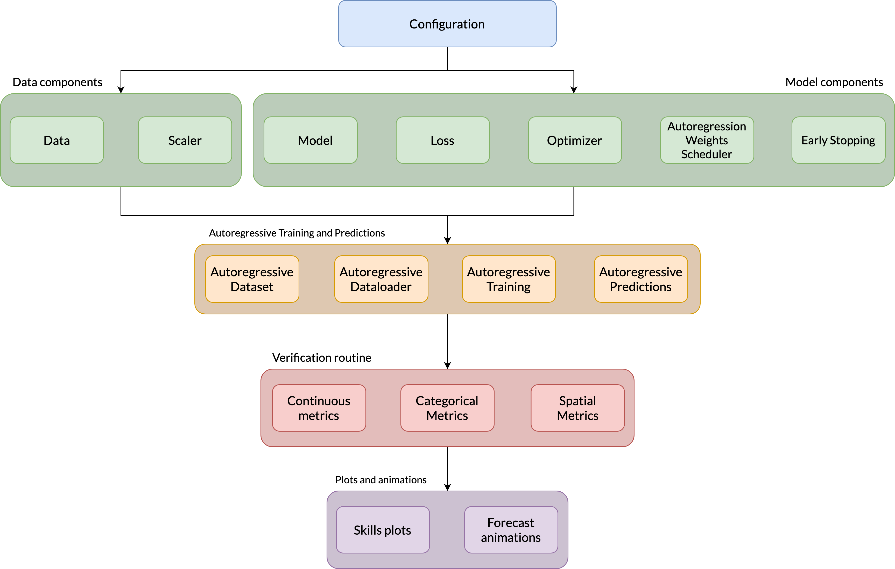
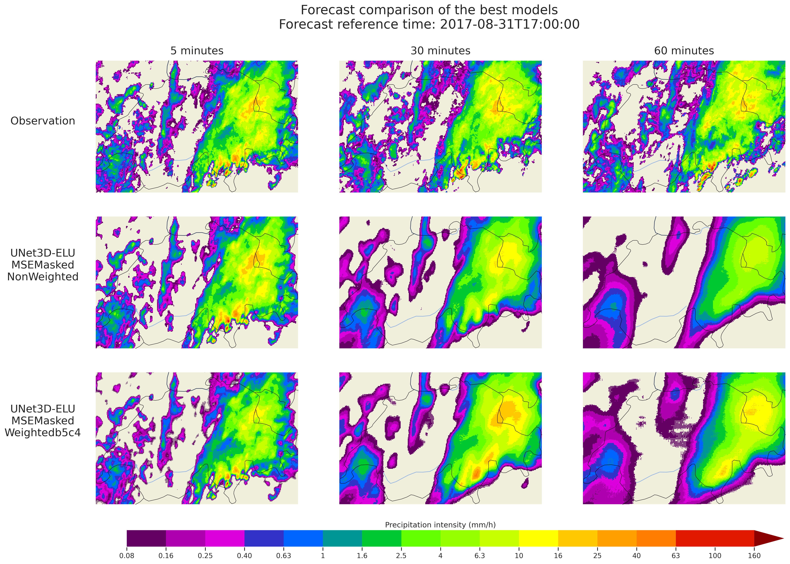

# The Nowcasting Project

This project proposes a flexible framework for the training of multi-horizon autoregressive deep learning (DL) models.

The structure of the repository is the following :
  * `configs/` contains all the configurations related to the training of models,
  * `nowproject/` contains all the modules and building blocks of the project
  * `scripts/` contains different useful scripts including computing benchmarks and training models


## 1. Install required libraries

Create a conda environment using the provided `environment.yml` file:
```shell
conda env create -f environment.yml
```

The environment file does not include [PyTorch](https://pytorch.org/get-started/locally/), to accomodate for the version that your setup is compatible with. Almost all of the code runs with PyTorch 1.9, except for the Optical Flow component, that requires the latest version.

This project made use of 3 additonal packages that can be retrieved with the following commands:
```shell
git clone git@github.com:ghiggi/xverif.git
cd xverif
git checkout categorical_scores

git clone git@github.com:ghiggi/xforecasting.git
cd xforecasting
git checkout nowcasting_changes

git clone git@github.com:ghiggi/xscaler.git
```

To use those packages, we need to add their paths to the `bashrc`:
```shell
# add xscaler, xforecasting and xscaler to PYTHONPATH
export PYTHONPATH="${PYTHONPATH}:/home/haddad/xscaler"
export PYTHONPATH="${PYTHONPATH}:/home/haddad/xforecasting"
export PYTHONPATH="${PYTHONPATH}:/home/haddad/xverif"
export PYTHONPATH="${PYTHONPATH}:/home/haddad/nowproject/"
```
Then apply the command ```source ~/.bashrc```.

## 2. Pipeline


The pipeline's components can be found under `nowproject/`.

## 3. Training models

`scripts/train.py` is the script used to train our models and that combines all the different elements of the pipeline. 

To reproduce the best results, you would need to use the following settings :
* **config**: `"configs/UNet3D/Residual-MaxPool2-Conv3-ELU.json"`
* **train/validation sets**:
  * *train*: 2018-01-01 -> 2018-12-31
  * *validation*: 2020-01-01 -> 2020-12-31
* **scaler**: Log Normalizer
* **loss**: Weighted value-masked MSE with $b=5$ and $c=4$ or unweighted value-masked MSE


## 3. Results


